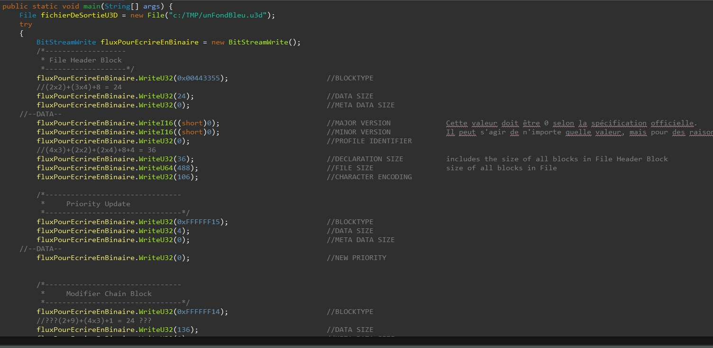

 

# Travail de stage

Il fallait réaliser un programme qui transforme du wrml en u3d afin d'avoir un fichier exploitable sous Adobe Acrobat Reader. 
Le stage a duré deux mois, et il a était impossible de finir ce travail qui nécessitait de reprendre toute la documentation [ECMA-363](https://www.ecma-international.org/publications-and-standards/standards/ecma-363/)

